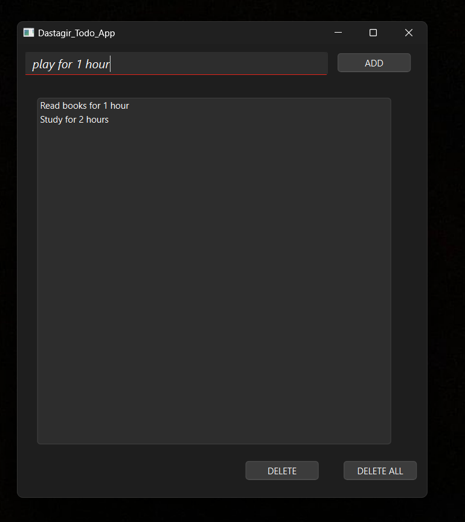

# Qt Todo App

## Overview

This Qt Todo app is a simple task management application built using Qt framework. It allows users to create, edit, and delete tasks, as well as mark them as completed.



## Features

- **Task Management**: Create, edit, and delete tasks.
- **Task Completion**: Mark tasks as completed.
- **Persistence**: Tasks are saved between application sessions.
- **Simple UI**: Intuitive user interface designed using Qt Widgets.

## Technologies Used

- **Qt Framework**: Used for building the graphical user interface and application logic.
- **C++**: Programming language used for implementing application functionality.

## Getting Started

### Prerequisites

- Qt framework installed (version X.X or higher).
- C++ compiler compatible with your Qt version.

### Installation

1. Clone the repository:

   ```bash
   git clone https://github.com/your-username/qt-todo-app.git
   cd qt-todo-app
